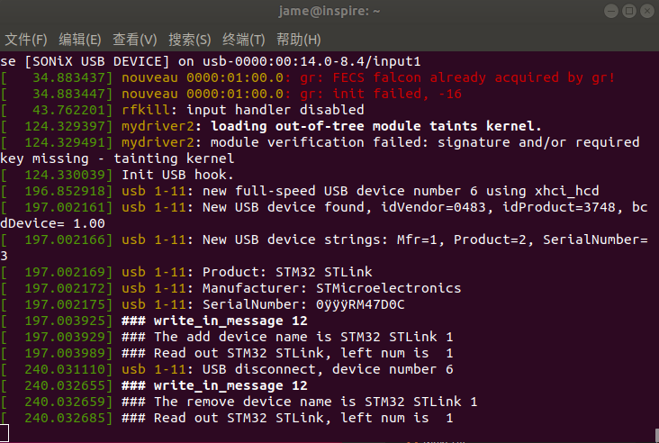
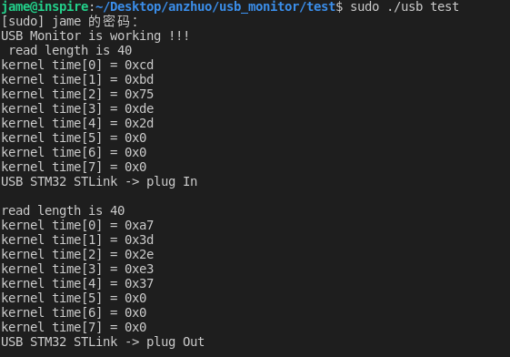

# Linux kernel driver development-USB hot plug information retrieval　　

　　1. Plug and unplug ST-Link  
　　
     　　dmesg debugging information display (beginning with ###)

　　2.　The user side reads, the USB name is STM32 STLink  

　　For more information:  
　　　[**My Blog**]()
  
  
